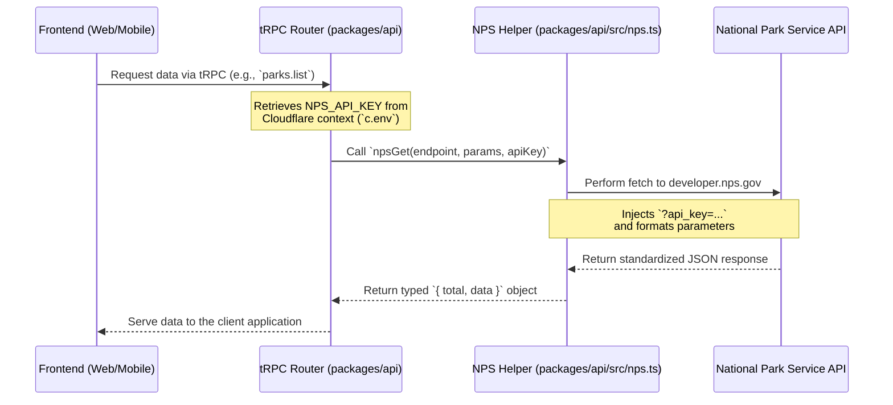

# NPS API Integration Skill

This skill provides the conventions, endpoint details, and reference code needed to integrate the National Park Service (NPS) REST API into this workspace. It guides developers on how to securely provide the NPS API key via Cloudflare Worker secrets, centralize standard API fetches using a reusable helper, and expose structured park data to client applications through tRPC procedures.

## How to use this skill

When building features that require National Park Service data, ensure this skill is loaded so that the assistant understands the NPS API endpoints, the query parameter conventions (like `parkCode` and `start`), and the required tRPC setup. Ask the assistant to "add an NPS endpoint" or "fetch campgrounds from the NPS API," and it will automatically scaffold the tRPC router and the corresponding `npsGet` usage based on the patterns defined in this skill.

## How it works

The following diagram illustrates the data flow for requesting information from the National Park Service API:

## Caching rules

Since National Park Service data (like park descriptions, visitor centers, and lesson plans) changes infrequently, you should implement caching to minimize external API calls and latency:
- **Client caching:** Use React Query's `staleTime` and `cacheTime` (configured on the tRPC client) to cache responses in the browser. 
- **Server caching:** Consider utilizing Cloudflare's Cache API or a KV store within the Cloudflare Worker to cache the results of the `npsGet` helper for a reasonable duration (e.g., 1 hour or 1 day, depending on the endpoint). Real-time endpoints like `/alerts` or `/webcams` should bypass server caching or use a very short TTL.

